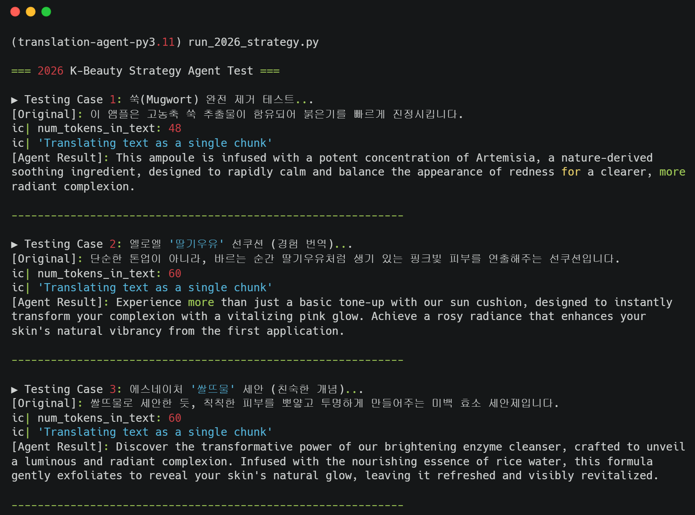

# K-Beauty Localization Agent 💄🇰🇷🇺🇸
**From "Literal Translation" to "Cultural Transcreation"**

> **Not just a translator, but a US Market Context Converter.**

This project is a specialized fork of [Andrew Ng's Translation Agent (GitHub)](https://github.com/andrewyng/translation-agent), designed exclusively for the **Korean Beauty (K-Beauty)** industry entering the US Market (Sephora, Amazon, Ulta). It moves beyond simple language translation to perform **Marketing Transcreation** compliant with 2026 US Beauty Trends and FDA/Cultural regulations.

---
**Agent Execution Preview:**
    <p align="center">
  
</p>

## 🚀 Key Features

### 1. 🎯 HSK-Based Category Intelligence
Dynamic strategy application based on product category (HSK Codes):
- **Skincare (3304.99)**: Focus on *Barrier Repair*, *Microbiome*, *Efficacy*.
- **Makeup (3304.10)**: Focus on *Flawless Finish*, *Transfer-proof*, *Long-wear*.
- **Body & Hair (3401/3305)**: Focus on *pH-balanced*, *Sulfate-free*, *Scalp Health*.

### 2. 🛡️ Strict Compliance & Ban List
Automatically detects and replaces high-risk terms:
- 🚫 **"Whitening" (미백)** → 🟢 **"Brightening", "Radiance", "Even Tone"** (Prevents racial bias issues)
- 🚫 **"Mugwort" (쑥)** → 🟢 **"Artemisia", "K-Herb Complex"** (Premiumizes ingredient perception)
- 🚫 **"Gentle" (순한)** → 🟢 **"Dermatologist Tested", "Barrier Support"** (Shifts to Verification)

### 3. 🔥 "Verification" Strategy (2026 Trend)
Replaces vague adjectives with trust-building "Verification Language":
- *Before*: "This is a good, mild toner."
- *After*: "A **Hypoallergenic**, **pH-balanced** toner **clinically proven** to soothe redness."

---

## 📊 Performance: Before vs After

| Case | Original (Korean) | Google Translate (Literal) | **K-Beauty Agent (Transcreation)** |
| :--- | :--- | :--- | :--- |
| **Case 1: Mugwort** | 쑥 추출물이 붉은기를 진정시킵니다. | Mugwort extract calms redness. | "**Artemisia** extract provides instant relief for sensitized skin and restores balance." |
| **Case 2: Texture** | 딸기우유 같은 톤업 효과 | Strawberry milk tone-up effect. | "Delivers a **Vitalizing Pink Glow** and **Rosy Radiance** for a healthy complexion." |
| **Case 3: Whitening** | 강력한 미백 효과 | Strong whitening effect. | "Potent **Brightening** formula to unveil **Luminous** and **Even-toned** skin." |

---

## 🛠️ Usage

### Installation
```bash
pip install translation-agent
# or using poetry
poetry install
```

### Quick Start
```python
import translation_agent as ta

source_text = "이 앰플은 고농축 쑥 추출물이 함유되어 붉은기를 빠르게 진정시킵니다."

# Specify 'category' for specialized rules ('skincare', 'makeup', 'body_hair', 'general')
translation = ta.translate(
    source_lang="Korean",
    target_lang="English",
    source_text=source_text,
    country="USA",
    category="skincare" 
)

print(translation)
```

## 🏗️ Architecture (Agentic Workflow)
1. **Initial Translation**: Generates a base draft.
2. **Contextual Reflection**: Analyzes the draft against `KBEAUTY_RULESET` (in `rules.py`). Identifies "Forbidden Words" as CRITICAL ERRORS.
3. **Strategic Improvement**: Rewrites the copy to maximize marketing impact and compliance.

## 📄 License
MIT License
